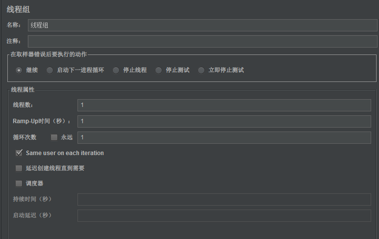
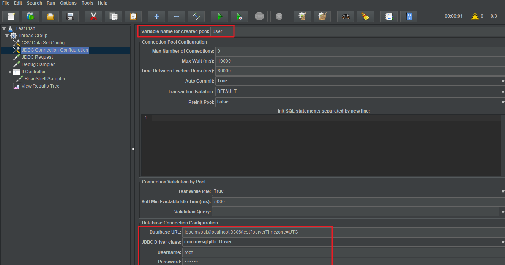
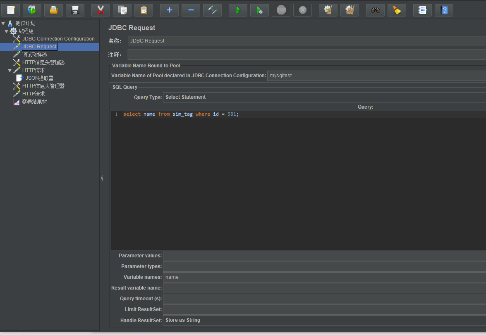

# Jmeter 参数化

## Jmeter工具组成
1、测试计划-->线程组
2、线程组：断言、定时器、监听器、配置元件、后置处理器、前置处理器、sample、逻辑控制器

### 线程组界面介绍：

名称：线程组名称

线程数：虚拟用户数，可以设置

Ramp-up：设置的虚拟用户数，启动的时间

循环次数：可以勾选永远，必须手动停止

调度器：可以设置启动时间和持续时间

### JDBC参数化设置

1、线程组中添加配置原件，JDBC connection configuration

variable Name for creates pool：与后面 jdbc request 中的名字相同

database url(mysql):jdbc:mysql://localhost:3306/test?serverTimezone=UTC，其中，test 为数据库名，serverTimezone 不设置时，会报错

JDBC driver class:mysql 的为 com.mysql.jdbc.Driver

username: 连接数据库的用户名 root

password：连接数据库的密码

2、添加 JDBC request

variable name of pool declared in jdbc config....:与之前 JDBC config 中配置的一致

sql query：查询 mysql 的语句

parameter values:当 where id = ？时，此值代替？

parameter type：parameter values 值在数据库中的类型如 int、varchar等

variable name：查询的结果变量

result variable name：存储查询语句查询的所有结果名

query timeout：查询超时时间

limit resuktset：最小结果集

handle resuktset：结果集类型设置

3、添加调试取样器(debug simple)

4、后面添加http请求

5、运行后，可看到调试取样器的结果

6、后续请求需要用到改取样器结果时，需要先使用函数助手中的__v函数转成字符

### CVS文件参数化