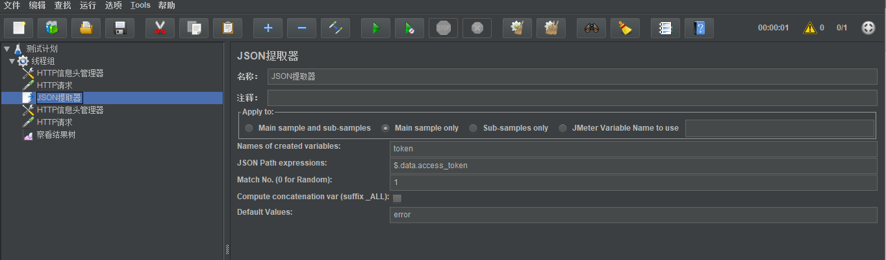
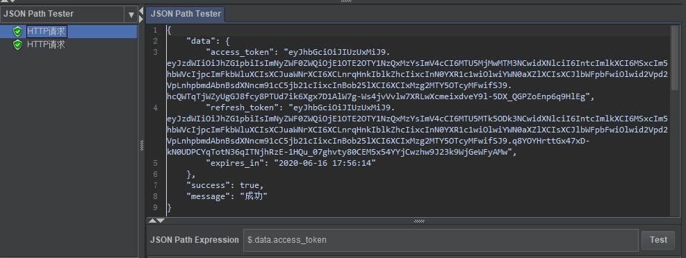
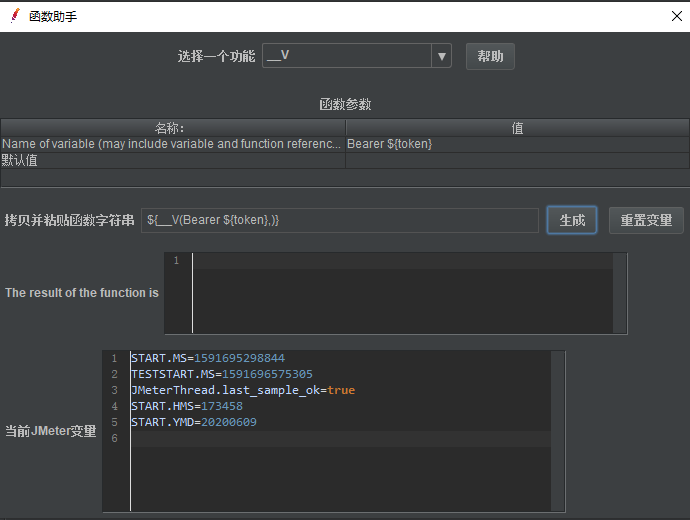
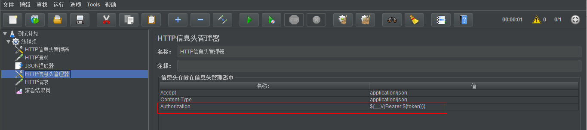

### 提取接口response中的数据

+ Json 提取器：提取上一请求中的response数据，使用$.获取
  

  

  $:表示最外层的数据

  $.data.access_token:也可写作$..access_token

  Json 提取器中的介绍：

  + Names of created variables： 接收值的变量名，自定义，多个变量用分号分隔  
  + JSON Path expressions：  json path表达式，也是用分号分隔  
  + Match No.(0 for Random)： 0表示随机；n取第几个匹配值；-1匹配所有。若只要获取到匹配的第一个值，则填写1 
  + Compute concatenation var(suffix_ALL)： 如果找到许多结果，则插件将使用' ， '分隔符将它们连接起来，并将其存储在名为<variable name> _ALL的var中 
  + Default Values： 缺省值，匹配不到值的时候取该值，可写error 

+ 使用函数助手拼接字符

  

  

将第一张图中生成的字符复制到第二张图中的参数中，如果没有其他参数时删除，

