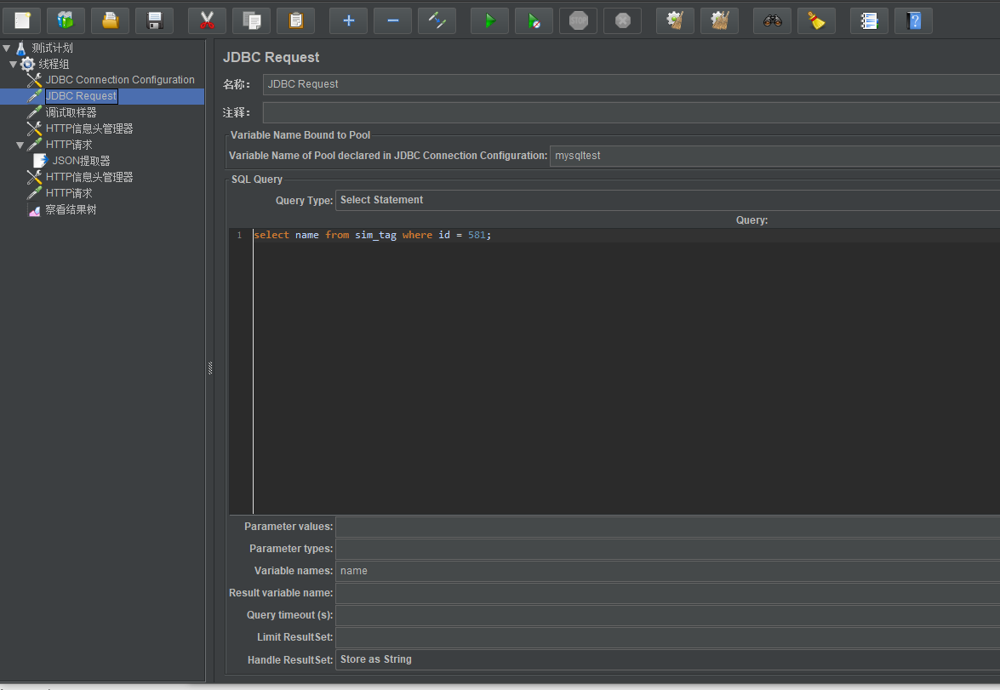
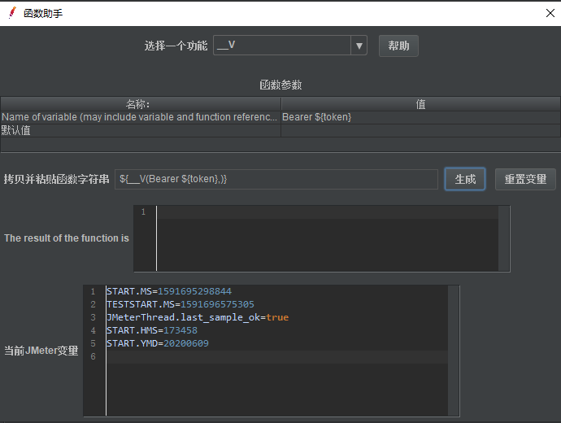

# Jmeter 工具

## Jmeter工具组成
1、测试计划-->线程组
2、线程组：断言、定时器、监听器、配置元件、后置处理器、前置处理器、sample、逻辑控制器

### 线程组界面介绍：

名称：线程组名称

线程数：虚拟用户数，可以设置

Ramp-up：设置的虚拟用户数，启动的时间

循环次数：可以勾选永远，必须手动停止

调度器：可以设置启动时间和持续时间

### JDBC参数化设置

1、线程组中添加配置原件，JDBC connection configuration

variable Name for creates pool：与后面 jdbc request 中的名字相同

database url(mysql):jdbc:mysql://localhost:3306/test?serverTimezone=UTC，其中，test 为数据库名，serverTimezone 不设置时，会报错

JDBC driver class:mysql 的为 com.mysql.jdbc.Driver

username: 连接数据库的用户名 root

password：连接数据库的密码

2、添加 JDBC request

variable name of pool declared in jdbc config....:与之前 JDBC config 中配置的一致

sql query：查询 mysql 的语句

parameter values:当 where id = ？时，此值代替？

parameter type：parameter values 值在数据库中的类型如 int、varchar等

variable name：查询的结果变量

result variable name：存储查询语句查询的所有结果名

query timeout：查询超时时间

limit resuktset：最小结果集

handle resuktset：结果集类型设置

### 提取接口response中的数据
+ Json 提取器：提取上一请求中的response数据，使用$.获取
	
	
	
	
	$:表示最外层的数据
	
	$.data.access_token:也可写作$..access_token
	
	Json 提取器中的介绍：
	
	+ Names of created variables： 接收值的变量名，自定义，多个变量用分号分隔  
	+ JSON Path expressions：  json path表达式，也是用分号分隔  
	+ Match No.(0 for Random)： 0表示随机；n取第几个匹配值；-1匹配所有。若只要获取到匹配的第一个值，则填写1 
	+ Compute concatenation var(suffix_ALL)： 如果找到许多结果，则插件将使用' ， '分隔符将它们连接起来，并将其存储在名为<variable name> _ALL的var中 
	+ Default Values： 缺省值，匹配不到值的时候取该值，可写error 
	
+ 使用函数助手拼接字符
	
	
	
	
将第一张图中生成的字符复制到第二张图中的参数中，如果没有其他参数时删除，
  

